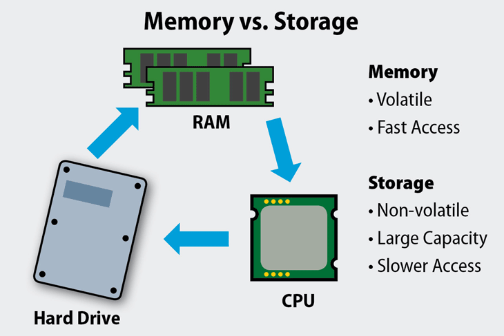
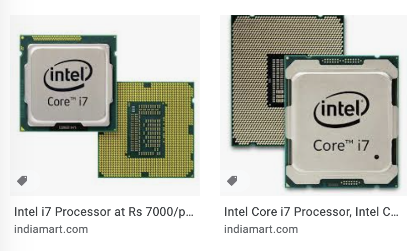
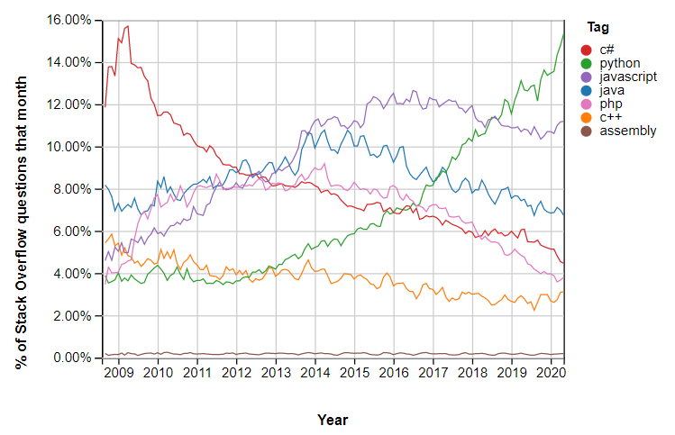
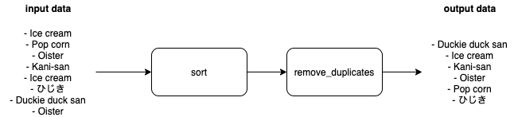
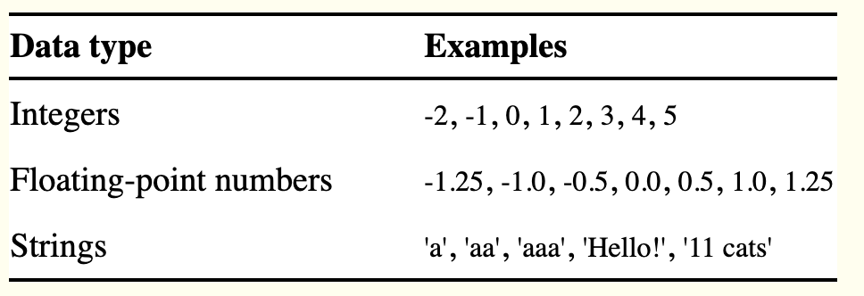

#  What is a Computer?

## How do we process information?

Solving an equation:
```
2x + 1 = 5
```

1. Find the equation in a book (**storage**)
2. Read it into your short-term memory (**memory**)
3. Solve it in your head (**processing**)
4. Write the answer in the book (**storage**)

## Parts of the computer

1. Storage = Hard drive (ms)
2. Memory = RAM (Read-access memory) (ns)
3. Processing = CPU (Central processing unit)

Memory is 100,000 times faster to read from!



## Storage: Hard Drive


## Memory: RAM


## Processing: CPU


# Program levels

## High-level language
```python
if (1 + 1) == 2:
    msg = "Hello min san san <3"
    print(message)
else:
    pass
```

## Assembly language
```
org  0x100
mov  dx, msg
mov  ah, 9
int  0x21 

mov  ah, 0x4c
int  0x21

msg  db "Hello min san san <3", 0x0d, 0x0a, '$'
```

## Machine code
```
010111111111001000111111111101000000110110010100101111111001000111111010000001101110010101111111001010001010111001010010111111111110010001100000000000000000001000000110110000010100000000000000000000000000000000000000010100101111111111100100011111110100000011011001010010111111001000111111010000001101100101011100101000000000000000000000101000000000000000000000000000101001011111111111001000110000000000000000000100000011011000001010 
```

High-level -> Assembly -> Machine code = **Compilation**


# Programming languages

Around **700 languages** 
## C
```c
#include 
 
int main(void)
{
    puts("Hello, world!");
}
```

## C++
```c++
#include 
 
int main()
{
    std::cout << "Hello, world!
";
    return 0;
}
```

## Python
```python
print("Hello, world!")
```

## Swift (iOS)
```swift
println("Hello, world!")
```

## Pascal
```pascal
program HelloWorld;
begin
  WriteLn('Hello, world!');
end.
```

## CoffeeSCript
```coffee
console.log 'Hello, world!'
```


# The rise of Python (1991)


```python
passwordFile = open("SecretPasswordFile.txt")
secretPassword = passwordFile.read()

print("Enter your password san")
typedPassword = input()

if typedPassword == secretPassword:
    print("Access granted")
    if typedPassword == "12345":
        print("That's a pretty shitty password san.")
else:
    print("Access denied")
```


# What is programming?

Writing instructions for the computer!

Program 1
1. Open that
2. Do this
3. Do that
4. If this, do that, else do this
5. Save this

## Abstractions

GOAL: Write a program that remove duplicates from a list

たらこさん shopping list:
- Ice cream
- Pop corn
- Oister
- Kani-san
- Ice cream
- ひじき
- Duckie duck san
- Oister

We can:
1. sort the list
2. Go through the list and delete identical items

Sorted たらこさん shopping list:
- Duckie duck san
- Ice cream
- Ice cream
- Kani-san
- Oister
- Oister
- Pop corn
- ひじき


sort program
```python
def sort(arr):
    if not arr:
         return arr
    for i in range(len(arr)):
         min_i = i
         for j in range(i + 1, len(arr)):
              if arr[j] < arr[min_i]:
                  min_i = j
         arr[i], arr[min_i] = arr[min_i], arr[i]
```

remove duplicates program
```python
def remove_duplicates(arr):
    prev_item = ""
    for item in arr:
        if prev_item == item:
            del item
        
        prev_item = item
```

So our final program is

```python
shopping_list = [
    "Ice cream",
    "Pop corn",
    "Oister",
    "Kani-san",
    "Ice cream",
    "ひじき",
    "Duckie duck san",
    "Oister",
]

sort(shopping_list)
remove_duplicates(shopping_list)
```
        



# Let's program!

## Setup

1. Install iTerm2 https://iterm2.com/
2. Install brew 

```bash
/bin/bash -c "$(curl -fsSL https://raw.githubusercontent.com/Homebrew/install/HEAD/install.sh)"
```

3. Install pyenv

```
brew install pyenv
brew install openssl readline sqlite3 xz zlib
pyenv install 3.9.1
pyenv global 3.9.1
```

4. Install VSCode https://code.visualstudio.com/download


## Interactive shell vs. program file

## Data types



```python
>>> type("nano")
>>> type(17)
>>> type(1.0)
```

**Operators change behaviour depending on the data type**

```python
>>> 1+1
>>> 1.0 + 1.1
>>> 1 + 1.0
>>> "min" + "san"
>>> "min" + 1
>>> "1" + 1

>>> 5 * 5
>>> 5.0 * 5.0
>>> 5 * 5.0
>>> "min" * 5
>>> "min" * 5.0
>>> "5" * 5
```

