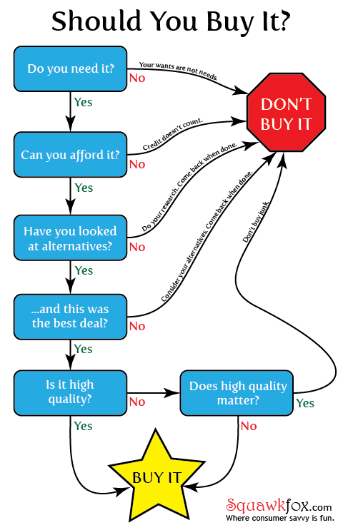
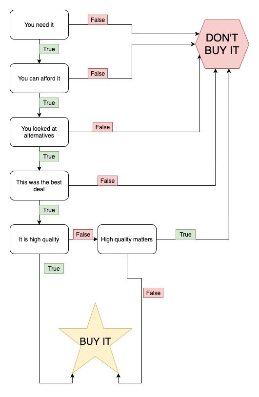
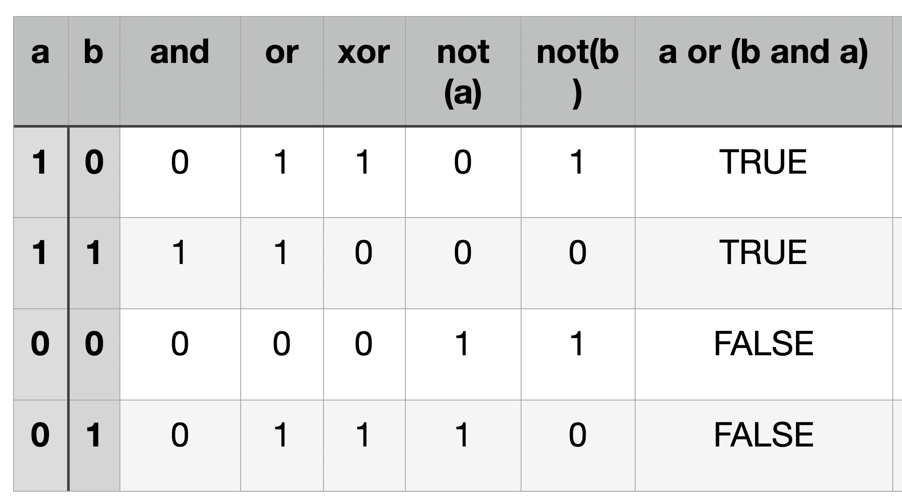

#  Flow Control 1

## Making decisions



In programming we use **statements** instead of *questions*.

- Do you need it? => You need it (True/False)
- Can you afford it? => You can afford it (True/False)
- Have you looked at alternatives? => You have looked at alternatives (True False)
- Was this the best deal? => ...
- Is it high quality? => ...
- Does high quality matter? => ...

So converted to statements which can be true/false it becomes:




## True/false statements in Python

```python
>>> 1 == 1
>>> 1 == 2
>>> 1 != 2
>>> type(1 == 1)
>>> type(True)
>>> type(False)
>>> 1 > 2
>>> 1 < 2
>>> 1 >= 1
>>> 1 == 1 and 2 == 2
>>> 1 == 1 and 2 == 1
>>> 1 == 1 or 2 == 2
>>> 1 == 1 or 2 == 1
>>> 1 == 5 or 2 == 1
>>> not 1 == 1
>>> 42 == 42.0
>>> 42 == '42'
```

These are called **Comparison operators**
- `>`
- `<`
- `>=`
- `<=`
- `==`
- `!=`

These are called **Boolean operators**
- `and`
- `or`
- `not` 

Let's create the statement: "Min san is older than min san"

```python
min_san_age = 32
min_chan_age = 31

print(min_san_age > min_chan_age)
```

It can be a bit difficult to read


```python
min_san_age = 32
min_chan_age = 31

min_san_is_older = min_san_age > min_chan_age
print(min_san_is_older)
```

## Logic




## The almighty `if` 

```python
min_san_age = 32
min_chan_age = 31

min_san_is_older = min_san_age > min_chan_age

if min_san_is_older:
    print("min san is super oooold saaaan ::::D")

```

Notice the block. What about this?

```python
min_san_age = 32
min_chan_age = 31

min_san_is_older = min_san_age > min_chan_age

if min_san_is_older:
    print("min san is super oooold saaaan ::::D")

print("なのっ")
```

### Introducing the `else` 


```python
min_san_age = 32
min_chan_age = 31

min_san_is_older = min_san_age > min_chan_age

if min_san_is_older:
    print("min san is super oooold saaaan ::::D")
else:
    print("なのっ")
```

### Finally, `elif`

```python
user_age = int(input())

if user_age < 10:
    print("baby san")
elif user_age < 20:
    print("teenage san")
else:
    print("min adult san")
```

# Homework san!!!!

## HW1

What are the two values of the Boolean data type? How do you write them in Python?

## HW2

What are the three Boolean operators?

## HW3

Write out the truth tables of each Boolean operator 

## HW4

What do the following expressions evaluate to?

### 1.
```python
(5 > 4) and (3 == 5)
```

### 2.
```python
not (5 > 4)
```

### 3.
```python
(5 > 4) or (3 == 5)
```

### 4.
```python
not ((5 > 4) or (3 == 5))
```

### 5.
```python
(True and True) and (True == False)
```

### 6.
```python
(not False) or (not True)
```

## HW5

What are the 6 comparison operators?

## HW6

Write a program that asks for the name of the user, using the `input()` function. If the user's name is 'Tarako', print 'Welcome back, Tarako-san'. Otherwise, print 'Access denied'. 

# HW7

Improve the program in HW6 so that the user's name can also be 'tarako' (lower-case), and it still prints 'Welcome back, Tarako-san'