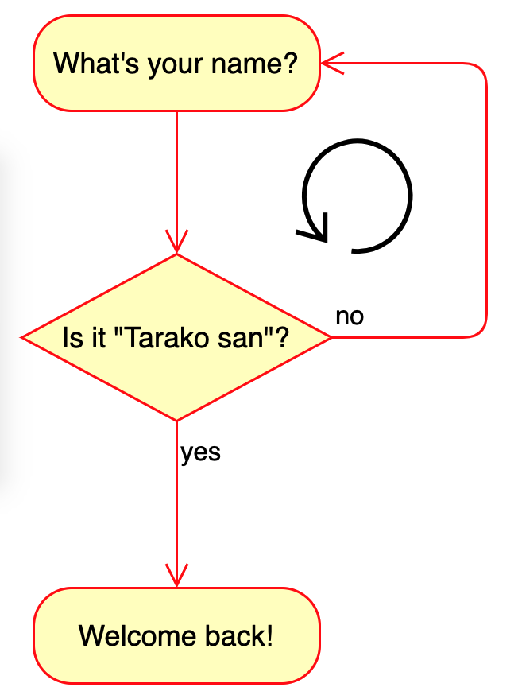
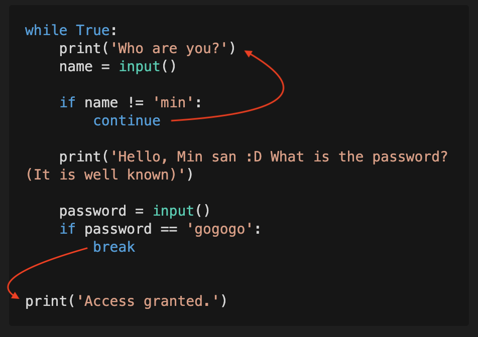

# Repeating stuff: Loops

Homework from last time
```python
print("what your name? ")
user_name = input()
if user_name == "tarako san":
    print("welcome back, tarako san")    
else:
    print("access denied")
```

What if we want the program to keep asking, until the user gets it right?
Something like:

```
> What's your name?
Min

> Try again
Ahhhh

> Try again
Tarako san

> Welcome back, Tarako san
```



We can say this is:


*Keep asking while `user_name` is not `"Tarako san"`*

## While Loops

```python
while bool:
    ...
```


```python
while True:
    print("min")
```
The above is called an **infinite loop**

```python
while False:
    print("min")

print("san")
```

```python
num_doughnuts = 10
while num_doughnuts > 0:
    print("eating doughtnut...")
    num_doughnuts = num_doughnuts - 1
    print(f"{num_doughnuts} left")

print("All done!")
```

```python
answer_correct = False

while not answer_correct:
    print("What's 1+1?")
    answer = input()
    answer_correct = answer == "2"

print("Yay")
```

### Exercise: **Solve the original problem!**




### Your first game! 

```python
import random
secretNumber = random.randint(1, 20)
print('I am thinking of a number between 1 and 20.')

attempts_left = 6
while attempts_left > 0:
    attempts_left = attempts_left - 1
    print('Take a guess.')
    guess = int(input())

    if guess < secretNumber:
        print('Your guess is too low.')
    elif guess > secretNumber:
        print('Your guess is too high.')
    else:
        break   

if guess == secretNumber:
    print('Good job! You guessed my number')
else:
    print('Nope. The number I was thinking of was ' + str(secretNumber))
```

# Homework

## HW1

What is the difference between break and continue?

## HW2 

Write a program that prints the numbers from 1 to 100

## HW3

Copy the 'Guessing number' game into a `.py` file and do the following modifications:

1) Use `time.sleep()` to make it seem like the computer is thinking when you enter a guess. You can add a `print()` saying something like `"Let me think...."` 
2) When the user enters a guess and is less than 5 away from the correct number print `"Getting closer!"` 
3) When the game ends and the user was only 1 away from the correct number print `"Almost! Try again"`.
4) Instead of ending the program when the game is over, ask the user if he/she wants to play again. For example print `"Try again? (Y/N)"` and if he/she types `"Y"` the game is restarted automatically. Otherwise it ends like before.


BONUS: Change the range to a number between 1 and 100, and give the player 7 attempts instead of 6. Play the game and find a method to always win. (We'll talk about this method next time!)
