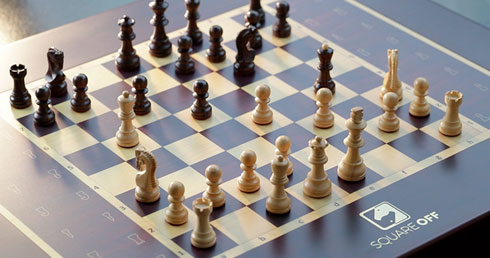

# Lesson 5: Computation and Algorithms

## How fast are computers?

```python
from timeit import default_timer as timer

start = timer()

# Do something...

end = timer()

print(f"Finished in {end - start:.10f} seconds")
```

Test on your own computer:

Exercise: Asssign a value to a variable in a `while` loop. How many iterations can you set the while loop to do until you notice the time it takes?

On my computer it took 7 seconds for 100,000,000 iterations.



Possibilities in chess:

*1000000000000000000000000000000000000000000000000000000000000000000000000000000000000000000000000000000000000000000000000*

If it takes 7 seconds to do 100,000,000 computations, to check all chess combinations it'll take

*31709791980000000000000000000000000000000000000000000000000000000000000000000000000000000000000000000000000000000 years*


For comparison, the age of the universe is: 

*13900000000 years*


## How do we compute complex problems?

### Number guessing game
