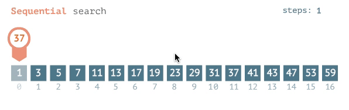
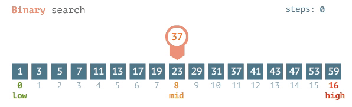
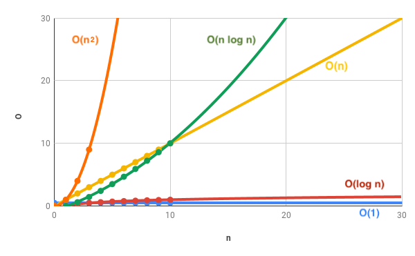

# Lesson 5: Computation and Algorithms

## How fast are computers?

```python
from timeit import default_timer as timer

start = timer()

# Do something...

end = timer()

print(f"Finished in {end - start:.10f} seconds")
```

Test on your own computer:

Exercise: Asssign a value to a variable in a `while` loop. How many iterations can you set the while loop to do until you notice the time it takes?

On my computer it took 7 seconds for 100,000,000 iterations.


Possibilities in chess:

*1000000000000000000000000000000000000000000000000000000000000000000000000000000000000000000000000000000000000000000000000*

If it takes 7 seconds to do 100,000,000 computations, to check all chess combinations it'll take

*31709791980000000000000000000000000000000000000000000000000000000000000000000000000000000000000000000000000000000 years*


For comparison, the age of the universe is: 

*13,900,000,000 years*


## How do we compute complex problems?

### Guess a number

**Naive method**
1. Is it 1?
2. Is it 2?
3. Is it 3?

How many guesses does it take *in the best/worst case* for guessing a number between 1-100?

**Best**: ?
<details>
  <summary>See answer</summary>
  O(1)
</details>


**Worst**: ?
<details>
  <summary>See answer</summary>
    O(N)
</details>

Generalizing: If instead of guessing a number between 1 and 100, we guess a number between 1 and N, the worst case is N, so we say, the time complexity of the naive method is:

*O(N)*

This means:

N = 100, worst case is 100 time units

N = 10000, worst case is 10000 time units

etc...

How many guesses does it take *in the worst case*?

This is called *Linear search* or *Sequential search* and it's the *brute force* solution.



**A better method** 

1. Look at the middle number: Is it higher or lower?
2. Repeat...




How many guesses does it take *in the best/worst case* for guessing a number between 1-100?

**Best**: ?
<details>
  <summary>See answer</summary>
  O(1)
</details>


**Worst**: ?
<details>
  <summary>See answer</summary>
    O(log N)
</details>

1, 2, 3, 4

1, 2, 3, 4, 5, 6, 7, 8

1, 2, 3, 4, 5, 6, 7, 8, 9, 10, 11, 12, 13, 14, 15, 16

1, 2, 3, 4, 5, 6, 7, 8, 9, 10, 11, 12, 13, 14, 15, 16, 17, 18, 19, 20, 21, 22, 23, 24, 25,26, 27, 28, 29, 30, 31, 32


**Comparison of the two**


## Comparison of time complexities



## Knapsack problem


Polynomial in time

# Homework

## HW1

Look up the following two algorithms (find some easy introduction videos on Youtube or some other easy to understand articles):

- Bubble sort
- Insertion sort

And at the next lesson:
- Explain how they work (make an example list of numbers that needs to be sorted, and show how each algorithm would sort it)
- Explain which one is faster and why?
- What are their worst case time complexities? (Using Big-Oh notation)